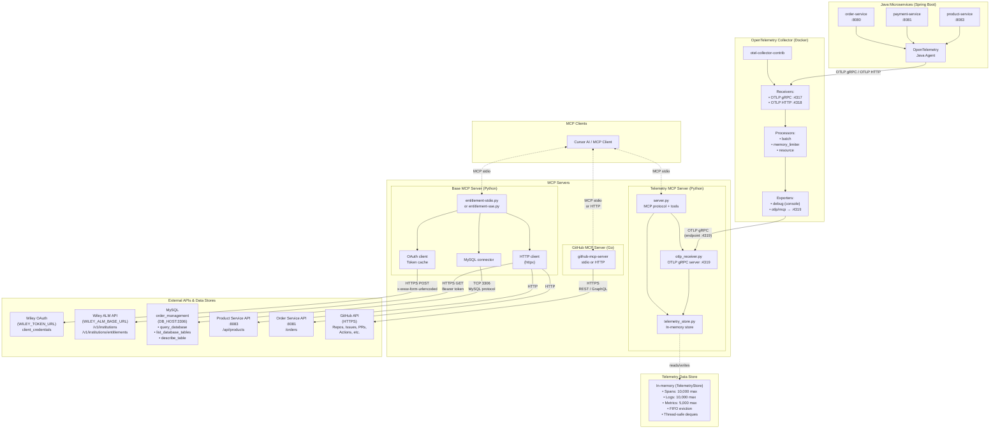
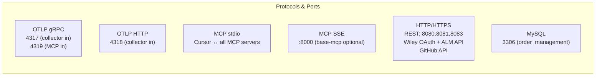
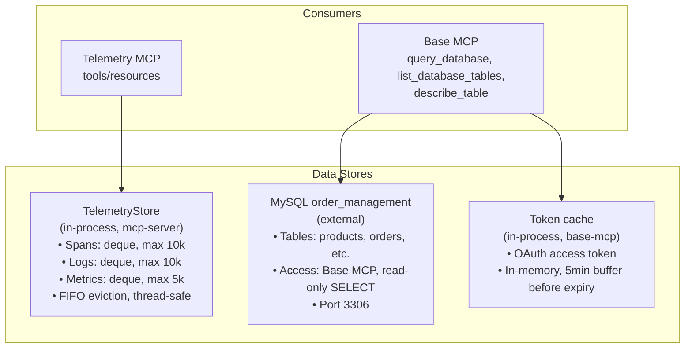
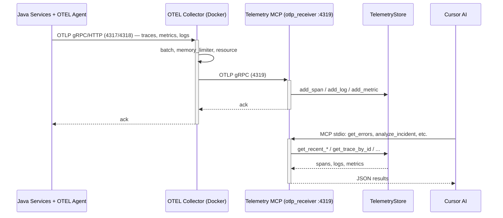

# AI Incident Resolver — Internal Architecture

Mermaid diagrams of components, protocols, data stores, and data flow.

---

## 1. Component & protocol overview

---

## 2. Protocols & ports

| Protocol | Port / Transport | Role |
|----------|-------------------|------|
| **OTLP gRPC** | 4317 (collector in), 4319 (MCP server in) | Java → Collector; Collector → Telemetry MCP |
| **OTLP HTTP** | 4318 (collector in) | Alternative Java → Collector |
| **MCP stdio** | stdin/stdout | Cursor ↔ all MCP servers |
| **MCP SSE** | 8000 (optional) | Base MCP HTTP/SSE transport |
| **MCP HTTP** | HTTPS | GitHub MCP remote (e.g. api.githubcopilot.com) |
| **HTTP/REST** | 8080, 8081, 8083 | order / payment / product services; Wiley ALM APIs |
| **MySQL** | 3306 | Base MCP → order_management DB |
| **HTTPS** | — | Wiley OAuth, Wiley ALM, GitHub API |

---

## 3. Data stores

| Store | Location | Contents | Access |
|-------|----------|----------|--------|
| **TelemetryStore** | In-process (mcp-server) | Spans (max 10k), logs (max 10k), metrics (max 5k); FIFO, thread-safe | Telemetry MCP tools/resources |
| **MySQL order_management** | External (DB_HOST:3306) | products, orders, etc. | Base MCP: query_database, list_database_tables, describe_table (read-only SELECT) |
| **Token cache** | In-process (base-mcp) | OAuth access token, expiry with 5min buffer | Base MCP for Wiley ALM API calls |

---

## 4. End-to-end telemetry pipeline

---

## Collector pipelines (otel-collector-config.yaml)

- **Receivers:** `otlp` — gRPC `0.0.0.0:4317`, HTTP `0.0.0.0:4318`
- **Processors:** `memory_limiter` → `batch` → `resource`
- **Exporters:** `debug` (console), `otlp/mcp` (MCP server at host:4319)
- **Pipelines:** traces, metrics, logs — each: receiver → processors → exporters
- **Extensions:** health_check (:13133), pprof (:1777), zpages (:55679); Prometheus metrics :8888

---

## File layout (architecture-related)

| Path | Role |
|------|------|
| `mcp-server/server.py` | Telemetry MCP entry; MCP tools/resources, wires OTLP receiver and store |
| `mcp-server/otlp_receiver.py` | OTLP gRPC server on :4319, pushes into TelemetryStore |
| `mcp-server/telemetry_store.py` | In-memory TelemetryStore (spans, logs, metrics) |
| `base-mcp-server/entitlement-stdio.py` | Base MCP over stdio; OAuth, MySQL, product/order HTTP |
| `base-mcp-server/entitlement-sse.py` | Base MCP over SSE on :8000 |
| `otel-collector/otel-collector-config.yaml` | Collector config (receivers, processors, exporters, pipelines) |
| `docker-compose.yaml` | Runs OTEL Collector container |
| `github-mcp-server/` | Go GitHub MCP server (stdio or HTTP) |
